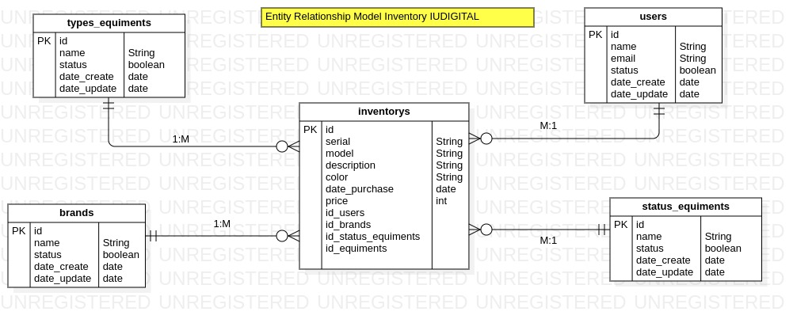

# Estructura del proyecto Inventory

### Carpeta de la aplicación

- **src**: Carpeta que contiene los archivos de la aplicación.
- Controlador
- modelos
- utils
- routes
- app.js
- server.js

# Se Crea el Modelo Entidad Relacion MER



## Librerias usadas en el proyecto
```
├── bcrypt@5.1.1
├── cors@2.8.5
├── dotenv@16.3.1
├── express@4.18.2
├── helmet@7.1.0
├── jsonwebtoken@9.0.2
├── mongoose@8.0.3
├── nodemon@3.0.2
├── sequelize@6.35.1
└── validator@13.11.0
```
### Instalación
```
npm install
```
### Ejecución
```
 npm run dev
 npm run start
```
